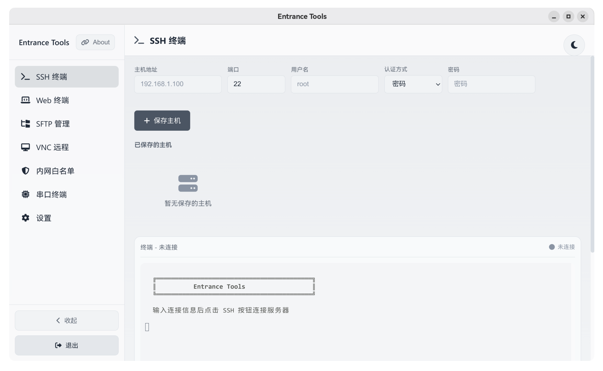

# Entrance-Desktop

[中文文档 / Chinese README](README_CN.md)

Desktop wrapper for [Entrance](https://github.com/fcanlnony/Entrance), built with Electron.



## Repository Layout

- `Entrance/`: backend submodule (kept with original folder name)
- `Desktop/`: Electron desktop source code
- `Share/Linux/`: Linux desktop icon and `.desktop` files
- `Share/Windows/`: Windows icon and shortcut assets

## Quick Start

1. Install dependencies:

```bash
npm run install:all
```

2. Start desktop app:

```bash
npm start
```

The Electron app auto-starts backend from `Entrance`.

## Build Packages

```bash
# current platform
npm run dist

# platform specific
npm run dist:linux
npm run dist:win
```

Artifacts are generated in `Desktop/dist/`.
Windows builds now produce a single portable `.exe`.

感谢测试: [makabaka2240](https://github.com/makabaka2240) 
