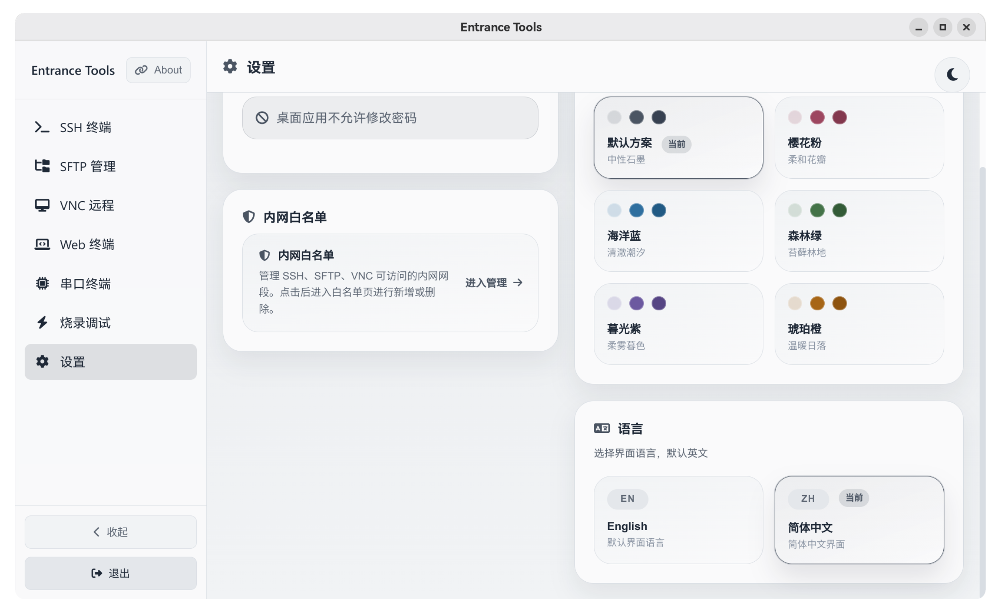

# Entrance-Desktop

[English README](README.md)

基于 Electron 的 [Entrance](https://github.com/fcanlnony/Entrance) 桌面封装。



## 仓库结构

- `Entrance/`: 后端子模块，保持原始目录名不变
- `Desktop/`: Electron 桌面端源码
- `Share/Linux/`: Linux 桌面图标与 `.desktop` 文件
- `Share/Windows/`: Windows 图标与快捷方式资源

## 快速开始

1. 安装依赖：

```bash
npm run install:all
```

2. 启动桌面应用：

```bash
npm start
```

Electron 应用会自动启动 `Entrance` 后端。

## 构建安装包

```bash
# 当前平台
npm run dist

# 指定平台
npm run dist:linux
npm run dist:win
```

构建产物输出到 `Desktop/dist/`。
Windows 构建当前会生成单个便携版 `.exe`。

感谢测试: [makabaka2240](https://github.com/makabaka2240)
